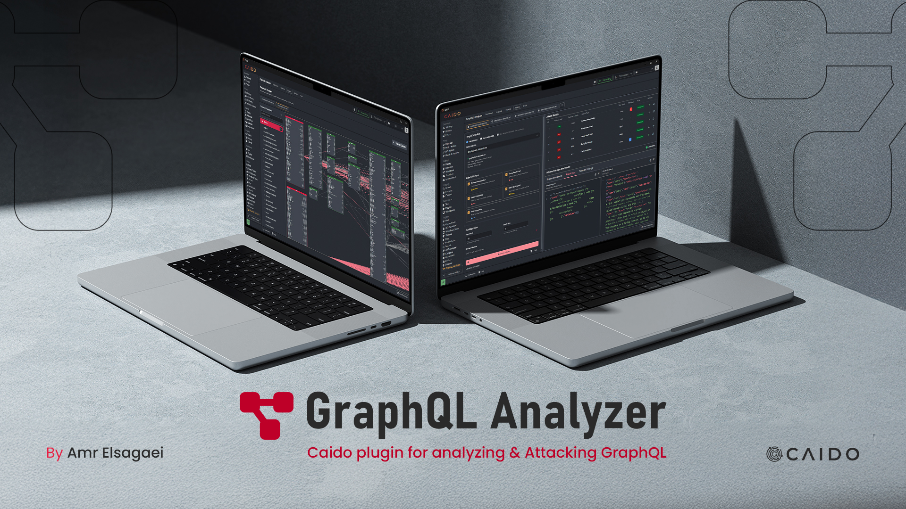

# GraphQL Analyzer

  
  

*Advanced GraphQL analysis, schema discovery, and security testing  Plugin For Caido*

## 🚀 Features

**GraphQL Analyzer** enhances Caido with powerful GraphQL security testing capabilities:

- 🔍 **Automatic Schema Discovery** - Extract GraphQL schemas through introspection
- 🌐 **Interactive Schema Visualization** - Explore GraphQL APIs with an intuitive graph interface  
- ⚔️ **Security Testing Suite** - Comprehensive vulnerability assessment tools
- 📊 **Attack Vectors** - Test for common GraphQL security issues
- 🎯 **Context Integration** - Seamless integration with Caido's workflow
- 📈 **Real-time Analysis** - Live security findings and recommendations

## 📦 Installation

### Via Caido Store (Recommended)
1. Open Caido
2. Navigate to **Plugins** → **Store**
3. Search for "GraphQL Analyzer"
4. Click **Install**

### Manual Installation
1. Download the latest release from [Releases](../../releases)
2. Open Caido → **Plugins** → **Installed**
3. Click **Install from file**
4. Select the downloaded `.zip` file

## ⚡ Quick Start

### 1. Discover GraphQL Endpoints
- Right-click any **POST request** in Caido's HTTP History
- Select **"Scan GraphQL Endpoint"** from the context menu
- GraphQL Analyzer will automatically detect and analyze the schema

### 2. Explore Schema
- Navigate to the **Explorer** tab
- Browse discovered types, queries, mutations, and subscriptions
- Click on any field to see detailed information

### 3. Visualize Relationships
- Switch to the **Voyager** tab
- Explore interactive schema graphs
- Understand API structure and relationships

### 4. Security Testing
- Go to the **Attacks** tab
- Select target endpoint (from context menu, custom URL, or session)
- Choose attack types and configure parameters
- Launch comprehensive security tests

### 5. Review Results
- Examine detailed findings with severity levels
- Use the **🔄 Replay** button to send results to Caido Replay
- Click **+ Create Finding** to add results to Caido's findings database

## 📖 Documentation

For comprehensive documentation including:
- **Detailed feature guides**
- **Attack configuration options**
- **Advanced usage patterns**
- **Troubleshooting tips**

Visit the **Docs** tab within the plugin interface.

## 🛡️ Security Testing Capabilities

GraphQL Analyzer includes advanced security testing for:

| Attack Type | Description |
|-------------|-------------|
| **Schema Introspection** | Test if schema introspection is enabled |
| **Query Depth Limit** | Assess query depth restrictions |
| **Query Complexity** | Evaluate complexity analysis implementation |
| **Batch Query Limit** | Test for batch query restrictions |
| **Field Suggestion** | Check for information disclosure in error messages |

## ⚙️ Requirements

- **Caido** v0.57.0 or higher

## 🤝 Contributing

Contributions are welcome! Please feel free to submit issues and enhancement requests.

## 📄 License

This project is licensed under the MIT License - see the [LICENSE](LICENSE) file for details.

---

  
Made with ❤️ by <a href="https://amrelsagaei.com">Amr Elsagaei</a> for the Caido and security community

